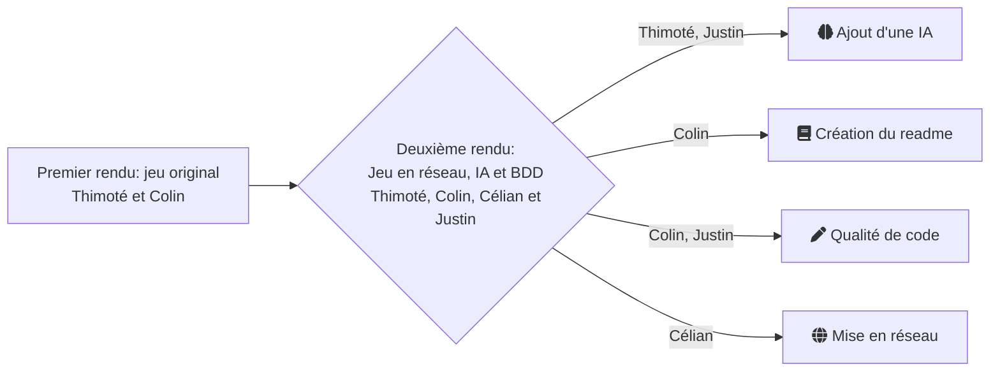

  <picture>
    <source media="(prefers-color-scheme: dark)" srcset="https://user-images.githubusercontent.com/25423296/163456776-7f95b81a-f1ed-45f7-b7ab-8fa810d529fa.png">
    <source media="(prefers-color-scheme: light)" srcset="https://user-images.githubusercontent.com/25423296/163456779-a8556205-d0a5-45e2-ac17-42d089e3c3f8.png">
    
  </picture>

  # Potich'Advendutes

  <!-- python badge -->
  
  

  <!--  -->

  [Contexte](##contexte) - [Gestion du projet](##gestion-du-projet) - [:star: Nous supporter :star:](#Nous-supporter)

  ---

## Contexte

Projet universitaire de création d'un jeu-vidéo. Cette collaboration en équipe s'inscrit dans la suite d'un projet en binôme.

Ci-dessous une visualisation des phases du projet:

## Gestion du projet

Le suivi du projet a principalement été fait via les issues Github. Le trello n'a été que peu utilisé après la phase de mise en place de 
la poursuite du projet.

Voici notre workflow adopté :

## Nous supporter

<!-- ====================RENDU FINAL==================== -->
<!-- TODO - Relire les issues -->
<!-- TODO - Remettre le jeu en fullscreen -->
<!-- TODO - Faire une release github -->

<!-- ====================ARCHIVE==================== -->
<!-- Vérifier avant rendu final -->
<!-- TODO - Readme -->
<!-- TODO - Cartes de départ -->
<!-- TODO - Curseur personnalisé ? -->
<!-- FIXME - rename les sons de racistes qui ont une majuscule -->

<!-- Dans le futur -->
<!-- TODO - Chanegr comment les animations sont chargées (virer props_catalogue -> get_tile_properties_by_gid) -->
<!-- TODO - méthode from_card_list() pour le main -->
<!-- TODO - Sauvegarde d'une partie -->
<!-- TODO - sprites randoms pour les ennemis -->
<!-- TODO - Axe Z (se cacher derrière les arbres ...)-->
<!-- TODO - Spawn des joueurs et des mobs avec des spawners sur la carte (dans tiled) -->
<!-- TODO - Déplacer la gestion du fog dans cell.py -->
<!-- TODO - Rendre tout responsive sur la verticale -->