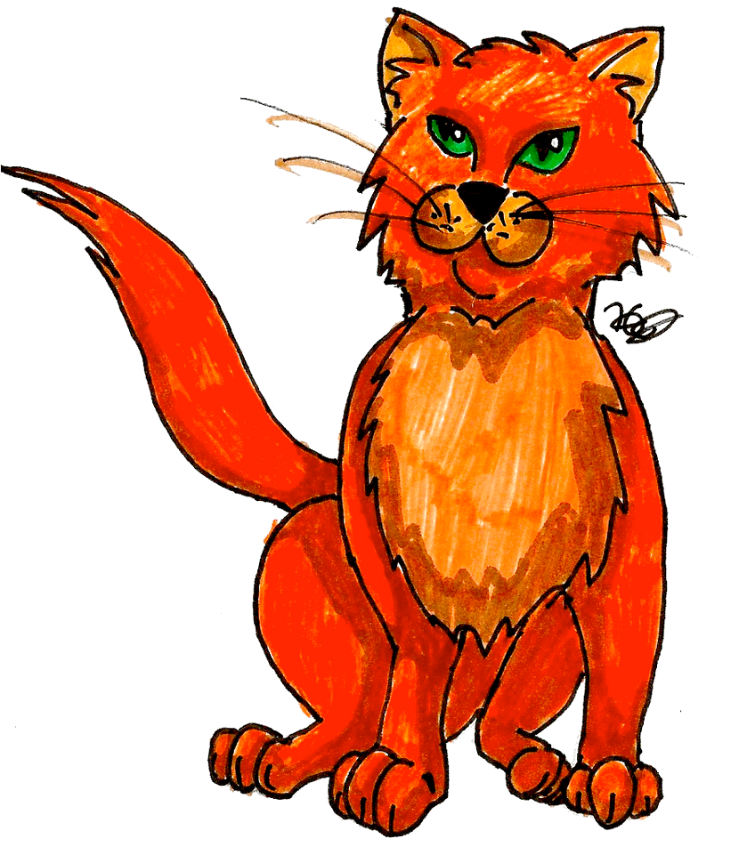
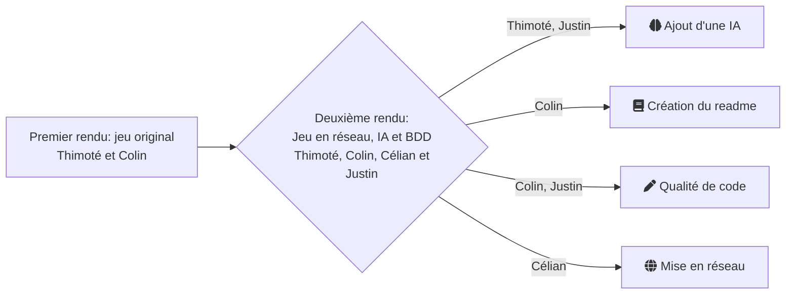
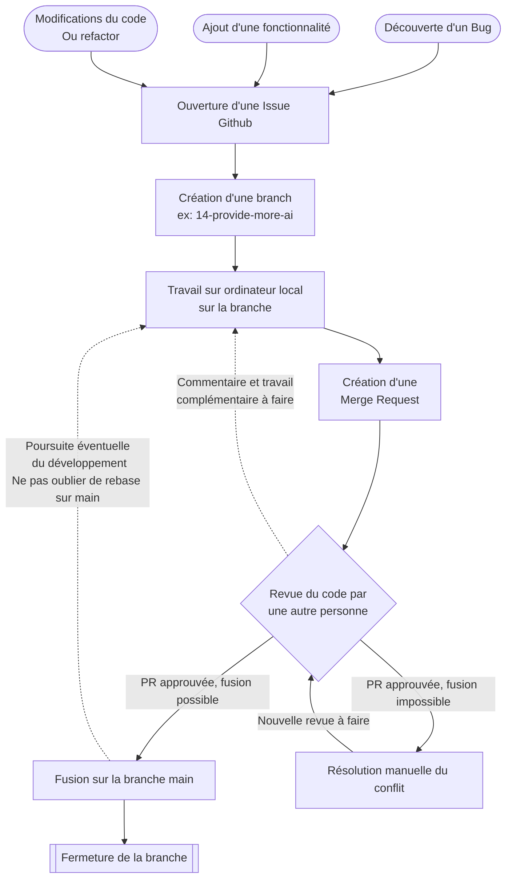

<div align="center">

  

  # Potich'Adventures

  <!-- python badge -->
  
  
  ![Tiled](https://img.shields.io/badge/Tiled-black?style=for-the-badge&logo=data%3Aimage%2Fpng%3Bbase64%2CiVBORw0KGgoAAAANSUhEUgAAAEAAAABACAYAAACqaXHeAAABhGlDQ1BJQ0MgcHJvZmlsZQAAKJF9kT1Iw0AcxV9TtUVaOrSDiEOG6mQXFXGsVShChVArtOpgcukXNLEkKS6OgmvBwY%2FFqoOLs64OroIg%2BAHi7OCk6CIl%2Fi8ptIjx4Lgf7%2B497t4BQqvGNLMvCWi6ZWTTKTFfWBEDrxhAGBFEEZSZWZ%2BVpAw8x9c9fHy9S%2FAs73N%2FjrBaNBngE4mTrG5YxOvE05tWnfM%2BcYxVZJX4nHjcoAsSP3JdcfmNc9lhgWfGjFx2jjhGLJZ7WOlhVjE04iniuKrplC%2FkXVY5b3HWag3WuSd%2FYaioLy9xneYI0ljAIiSIUNBAFTVYSNCqk2IiS%2FspD%2F%2Bw45fIpZCrCkaOeWxAg%2Bz4wf%2Fgd7dmaXLCTQqlgP4X2%2F4YBQK7QLtp29%2FHtt0%2BAfzPwJXe9W%2B0gJlP0ptdLX4ERLaBi%2BuupuwBlzvA0FNdNmRH8tMUSiXg%2FYy%2BqQBEb4HBVbe3zj5OH4AcdZW5AQ4OgbEyZa95vDvY29u%2FZzr9%2FQA2VHKOE1xX8AAAAAZiS0dEAP8A%2FwD%2FoL2nkwAAAAlwSFlzAAALEwAACxMBAJqcGAAAAAd0SU1FB%2BgGDQ8TGUUxsF0AAAFsSURBVHja7dkxS8NAGMbxf0xQOjToqF0qddJN8APoIuh3UJz9AE5iBb%2BBuAlOTtVVXJwcOytFKnZRh%2BJgnSqEONiDDG6%2BBwn3PBDILe9dfjku3AUURVECTgQ0gbXAnrsLDBzAGzAfGMA7sOAAcoDm0pZJ5UH%2FhirUA1rAMHGt9c1Tkw4uJh2UvR6wA4ymAl8D09ABEIAABCAAAQhAAAIQQKhJ%2FtglmaTfuzKtZz0%2BlwgYA9MhvfUoirM8z04cwC6wXU8bKxbFv0avy572748A9bRhMcZOcQa4HAKxwZiPAPb2n23272ctd3vsYTJkSaFxy%2B%2F5YNnzYLm0FAG6k6vs6egzKAABCEAAAhCAAAQgAMPzAOtYnwdUDuD%2B7iBsAA%2FnAdUC8PA%2FX4ugAAQgAAEIQAACEIAABCCA8m%2BGvsefYQNcnq8GC3ANbAA1gDiZ%2BXfB2bnFl49hzwtA5BG3XYW6PhfBp4rUVBRFUYLND5HwU90jkFeyAAAAAElFTkSuQmCC)


  <!-- Badge dynamiques, ne marchent pas sur un répo privé -->
  <!--  -->


  [Contexte](#contexte) - [Gestion du projet](#gestion-du-projet) - [Installation](#installation) - [Lancer le projet](#lancer-le-projet) - [:star: Nous supporter :star:](#Nous-supporter)


  ---


</div>

## Contexte

Projet universitaire de création d'un jeu-vidéo. Cette collaboration en équipe de quatre s'inscrit dans la suite d'un projet en binôme.

Ci-dessous une visualisation des phases du projet:




## Gestion du projet

Le suivi du projet a principalement été fait via les issues Github. Le trello n'a été que peu utilisé après la phase de mise en place de 
la poursuite du projet.

Voici notre workflow adopté pour le développement du projet :



## Installation

### Prérequis

Python 3.12 est requis pour lancer notre projet.

Installation selon votre distribution:

<details>
<summary>Windows</summary>

Lancer le .exe disponible sur le [site officiel](https://www.python.org/downloads/windows/)

Pour les utilisateurs de choco, dans un terminal administrateur:

```bash
choco install python
```
</details>

<details>
<summary>Debian / Ubuntu</summary>

```bash
sudo apt-get update && sudo apt-get upgrade
sudo apt-get install python3
```
</details>

<details>
<summary>Arch</summary>

```bash
sudo pacman -Syu
sudo pacman -S python
```
</details>

<details>
<summary>Fedora / RHEL</summary>

```bash
sudo dnf upgrade --refresh
sudo dnf install python
```
</details>

<details>
<summary>MacOS</summary>

```bash
brew install python@3.12
```
</details>


### Modules python

Une fois python installé, il faut installer les modules. Nous recommandons tout d'abord de créer un environnement virtuel python.


Création du venv :

```bash
python -m venv .venv # Ou python3 selon l'OS

# Linux et MacOS
source .venv/bin/activate

# Windows
# cmd.exe
.venv\Scripts\activate.bat
# PowerShell
.venv\Scripts\Activate.ps1


# Pour désactiver (tout OS)
deactivate
```

Installation des modules :

```bash
pip install -r requirements.txt
```

## Lancer le projet

Assurez-vous de que votre python dispose des bons modules (activez le venv si besoin !). 
Lancer le serveur avec la commande:


```bash
python server.py

# Arguments possibles supplémentaires. Pour les voir, utiliser la commande: 
python server.py --help
```

Une fois le serveur lancé, lancer dans un autre terminal le(s) client(s) :

```bash
python main.py
```

Cliquer sur `New Game` > `Online` et entrer l'addresse IP du serveur. Il est également possible de jouer seul en séléctionnant `Solo` plutôt que `Online`.

Une fois le bon nombre de joueurs connectés (2 par défaut), le serveur démarre la partie. Le tutoriel explique 
la plupart du jeu, et nous vous invitons **fortement** à en prendre avantage ! Si besoin, vous trouverez un résumé 
rapide ci-dessous.

<details>
<summary>Résumé rapide du jeu</summary>

L'objectif est de réunir les clés réparties aux 4 coins de la carte. Pour ce faire, les joueurs doivent chacun leur tour utiliser l'une de leur cartes de déplacement pour déplacer 
un pion joueur. **Les pions joueurs sont communs à tous les joueurs** ! Chaque joueur ayant des cartes de déplacement limitées, il est nécessaire d'établir une stratégie commune.

</details>


#### Raccourcis clavier :

| Touche                                                                                                | Action                                                                   |
| ----------------------------------------------------------------------------------------------------- | ------------------------------------------------------------------------ |
| <div align="center"><kbd>↑</kbd><br/><kbd>←</kbd><kbd>↓</kbd><kbd>→</kbd></div>                       | Déplace la caméra                                                        |
| <kbd>TAB</kbd>                                                                                        | Ouvre le menu lattéral                                                   |
| <kbd>1</kbd><kbd>2</kbd><kbd>3</kbd><kbd>4</kbd><br/><kbd>&</kbd><kbd>é</kbd><kbd>"</kbd><kbd>'</kbd> | Sélection rapide de la carte du menu lattéral                            |
| <kbd>SPACE</kbd>                                                                                      | Passe le tour (par choix stratégique ou si impossible de bouger par ex.) |
| <kbd>ESC</kbd>                                                                                        | Quitte la partie                                                         |


## Nous supporter

La meilleure manière de nous supporter est de nous mettre une bonne note :wink:


<!-- ====================RENDU FINAL==================== -->
<!-- TODO - Relire les issues -->
<!-- TODO - Remettre le jeu en fullscreen -->
<!-- TODO - Faire une release github -->


<!-- ====================ARCHIVE==================== -->
<!-- Vérifier avant rendu final -->
<!-- TODO - Readme -->
<!-- TODO - Cartes de départ -->
<!-- TODO - Curseur personnalisé ? -->
<!-- FIXME - rename les sons de racistes qui ont une majuscule -->

<!-- Dans le futur -->
<!-- TODO - Chanegr comment les animations sont chargées (virer props_catalogue -> get_tile_properties_by_gid) -->
<!-- TODO - méthode from_card_list() pour le main -->
<!-- TODO - Sauvegarde d'une partie -->
<!-- TODO - sprites randoms pour les ennemis -->
<!-- TODO - Axe Z (se cacher derrière les arbres ...)-->
<!-- TODO - Spawn des joueurs et des mobs avec des spawners sur la carte (dans tiled) -->
<!-- TODO - Déplacer la gestion du fog dans cell.py -->
<!-- TODO - Rendre tout responsive sur la verticale -->